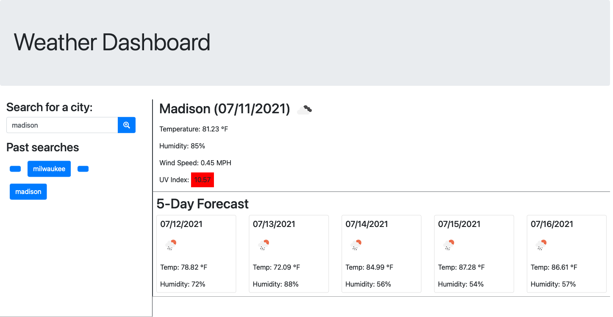

# Challenge 6 Weather Dashboard

[Link to deployed application](https://thomasbewell.github.io/weather-dashboard-6/)

## Purpose

This is the 6th challenge assignment for my coding boot camp. For it I created an app that allows the user to view current and future weather conditions by searching for a city. 

## Technology

Languages: HTML, CSS, Javascript 

API: OpenWeatherAPI

## Screenshot

